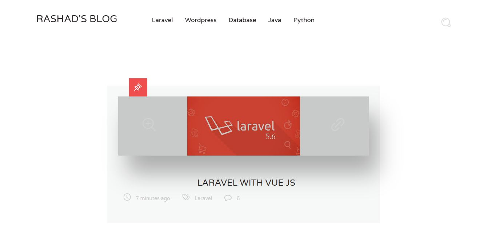
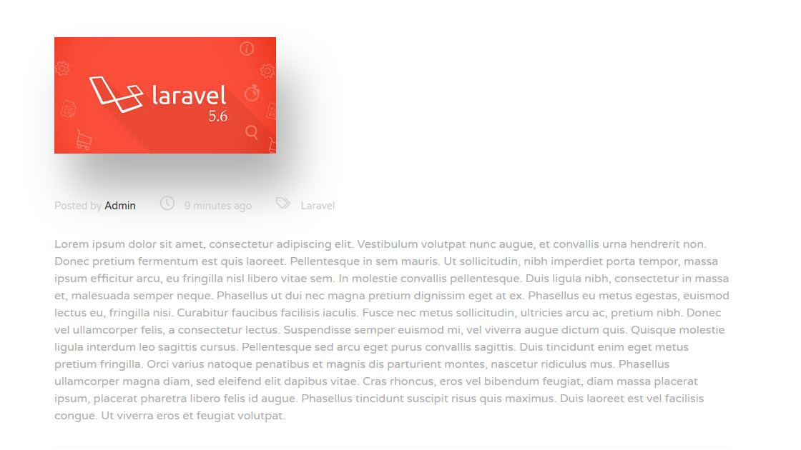
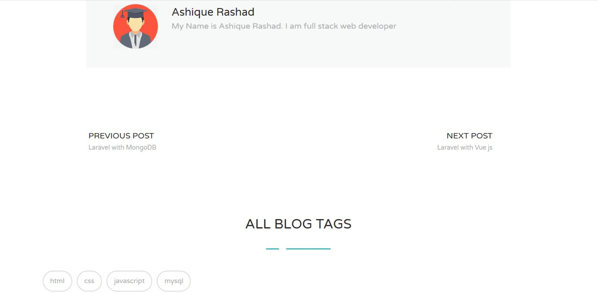
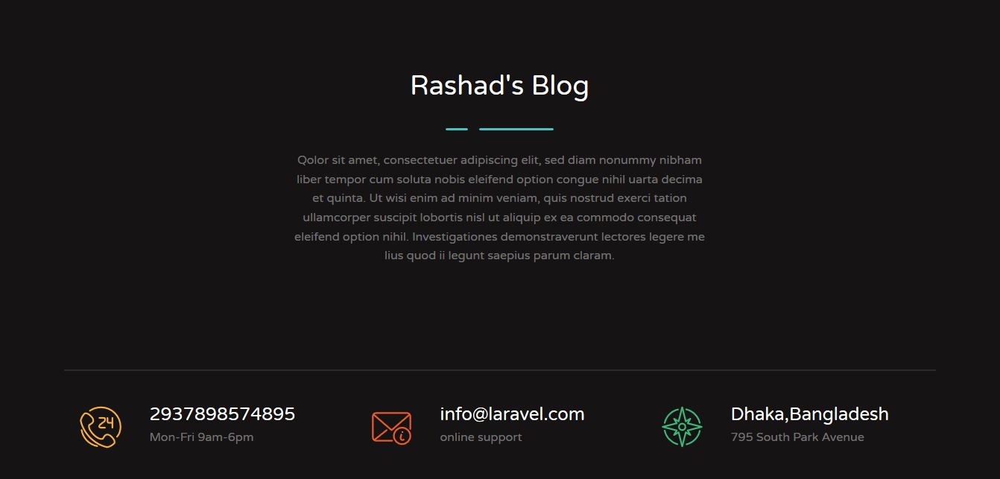

<h1 align="center">Blog Management System</h1>

## Description

<p>It's an blog content management application . The admin of this application can create different blogs . Admin can update and delete blogs . The visitor part of this application maintains a good user interface . Visitors will be able to search blogs category-wise . Every blog contains various informations about that blog . </p>
<br>

## How To Run This Project

<p><b> Step - 1 :- </b> Download or clone this project from this repository . </p>

<p><b> Step - 2 :- </b> Create a database named blog in your phpmyadmin .</p>

<p><b> Step - 3 :- </b> Go to your directory where your downloaded or cloned project is located . Open your terminal there . Gitbash terminal is preferred . Now run this command :- </p>

```
php artisan migrate 
```

<p><b> Step - 4 :- </b>Now run this command in your terminal :-  </p>

```
php artisan db:seed
```

<p><b> Step - 5 :- </b> Then run this command in your terminal :- </p>

```
php artisan serve
```

Now copy that localhost link and paste it in your browser .

<p><b> Step - 6 :- </b>Now you are in the visitor page . To add some posts click to add post . Now to access the administrator account log in with password "password" and email "ashique@gmail.com" . </p>
<br>


<h2 align="center">Project Screenshots</h2>

<p align="center">
  
  
</p>

<p align="center">
  
  
</p>  
